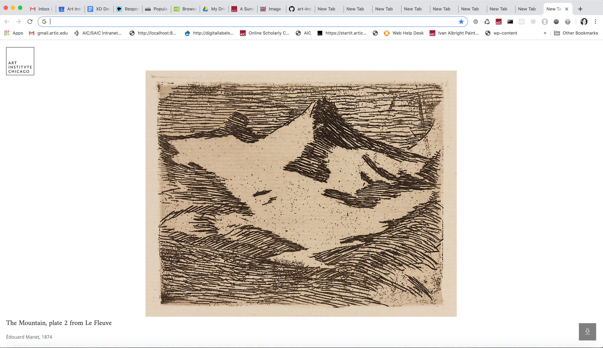
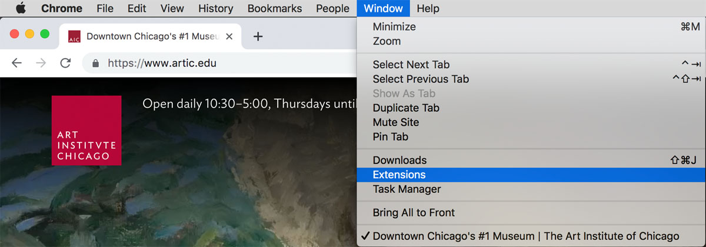
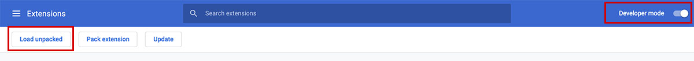

.

# Art Institute of Chicago Browser Extension

> A browser extension that presents a random work of art from the Art Institute of Chicago's collection with each new tab.

In September 2019, the Art Institute of Chicago (AIC) launched its data API for public use. The API provides information and access to over 100,000 artworks.

Using the data API and [IIIF's image API](https://iiif.io), AIC's browser extension presents an artwork from the museum's collection in your browser every time a new tab is opened. The extension focuses on selecting from over 50,000 works marked for [public domain](https://www.artic.edu/image-licensing) use.

For public use, this extension is available in the Chrome Web Store [link]. If you'd like to install the plugin for local development, follow the instructions below.

This repo serves as an example of using the Art Institute of Chicago's data API.



## Features

* Presents artwork from the Art Institute's collection in new browser tab
* Demonstrates use of the Art Institute's data API

## Requirements

Chrome browser in Developer Mode

## Installing

Clone or download the project:

```shell
git clone https://github.com/art-institute-of-chicago/browser-extension.git
cd browser-extension
```

* If you downloaded a zip file from GitHub, unzip the package
* From Chrome menu choose Window - Extensions
* Toggle on "Developer Mode"
* Click "Load Unpacked"
* Select the browser-extension folder you cloned
* Optionally toggle "Developer Mode" off





## Configuration

In [script.js](script.js), you'll find the query that fetches a random artwork:

```
let timeStamp = Math.floor(Date.now() / 1000);
    let artworkRequest = {
        "resources": "artworks",
        "fields": [
            "id",
            "title",
            "artist_title",
            "image_id",
            "date_display",
	    "thumbnail"
        ],
        "boost": false,
        "limit": 1,
        "query": {
            "function_score": {
                "query": {
                    "bool": {
                            "must": [
                                {
                                    "term": {
                                        "is_public_domain": true
                                    },
                                },
                                {
                                    "exists": {
                                        "field": "image_id",
                                    },
                                },
                            ],
                        },
                    }
                },
                "boost_mode": "replace",
                "random_score": {
                    "field": "id",
                    "seed": timeStamp
                }
            }
        }
    };
```

## Contributing

We encourage your contributions. Please fork this repository and make your changes in a separate branch. To better understand how we organize our code, please review our [version control guidelines](https://docs.google.com/document/d/1B-27HBUc6LDYHwvxp3ILUcPTo67VFIGwo5Hiq4J9Jjw).

```bash
# Clone the repo to your computer
git clone git@github.com:your-github-account/browser-extension.git

# Enter the folder that was created by the clone
cd browser-extension

# Start a feature branch
git checkout -b feature/good-short-description

# ... make some changes, commit your code

# Push your branch to GitHub
git push origin feature/good-short-description
```

On github.com, create a Pull Request to merge your changes into our
`develop` branch.

This project is released with a Contributor Code of Conduct. By participating in
this project you agree to abide by its [terms](CODE_OF_CONDUCT.md).

We welcome bug reports and questions under GitHub's [Issues](issues). For other concerns, you can reach our engineering team at [engineering@artic.edu](mailto:engineering@artic.edu)

## Acknowledgements

AIC's browser extension was conceived in the Experience Design department during the 2018 internship program, Diversifying Art Museum Leadership Initiative (DAMLI).
Thanks to our intern, [Abdur Khan](https://github.com/AKhan139), for helping make this project possible.

Additional thanks to [Mark Dascoli](https://github.com/markdascoli), [Illya Moskvin](https://github.com/IllyaMoskvin), [Tina Shah](https://github.com/surreal8), Kirsten Southwell, and [nikhil trivedi](https://github.com/nikhiltri), for helping complete version 1 of the browser extension.

Inspiration for this project came from the following browser extension projects:
- [David Rumsey Map Collection - MapTab](https://chrome.google.com/webstore/detail/david-rumsey-map-collecti/fnheacjohhlddiffbmafmpoblbkfgmde?hl=en)
- [ueno.design](https://chrome.google.com/webstore/detail/uenodesign/iiekikakogelhkneknonedfhcajdlgda)
- [Muzli 2 - Stay Inspired](https://chrome.google.com/webstore/detail/muzli-2-stay-inspired/glcipcfhmopcgidicgdociohdoicpdfc)

The following tutorial helped us get started:
[How to Create and Publish a Chrome Extension in 20 minutes](https://www.freecodecamp.org/news/how-to-create-and-publish-a-chrome-extension-in-20-minutes-6dc8395d7153/) from [freeCodeCamp.org](https://freeCodeCamp.org)

## Licensing

This project is licensed under the [GNU Affero General Public License
Version 3](LICENSE).
